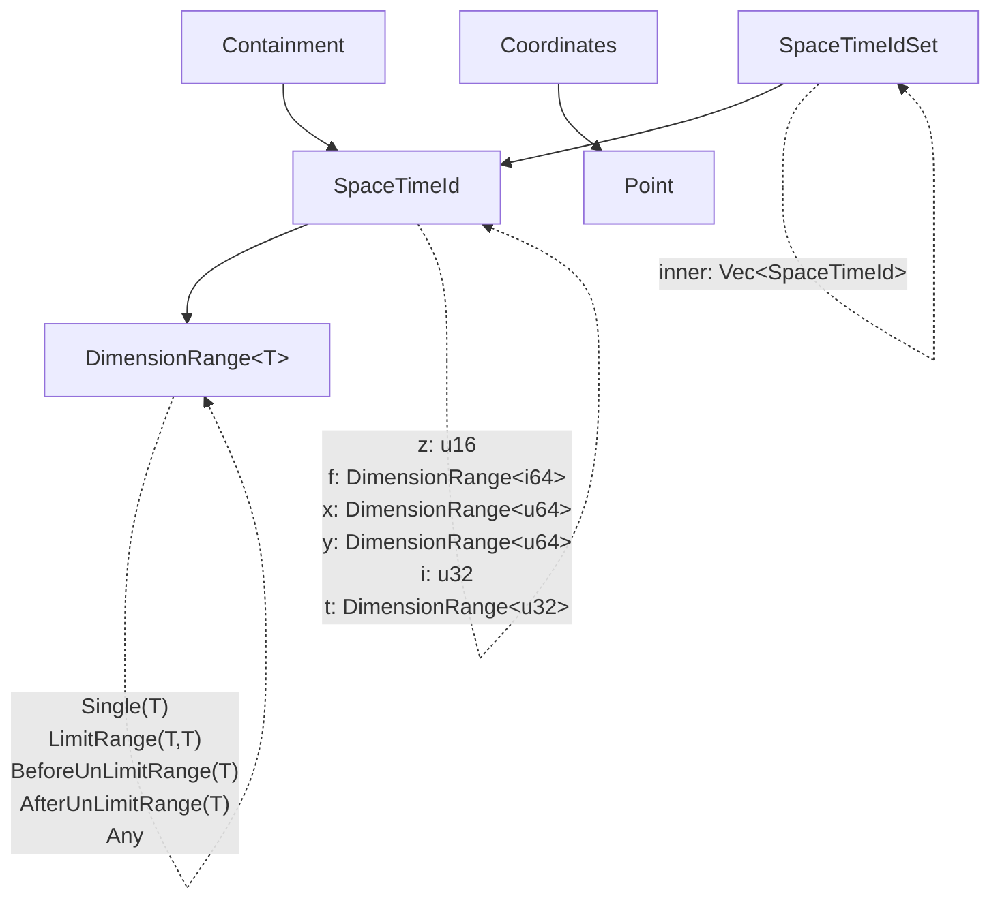

# Function and Type Dependency Graph

This document describes the dependencies between types and functions in the Kasane Logic library. The library is structured around spatial-temporal identifiers and their operations, with types and methods that depend on each other to provide comprehensive functionality.

## Core Type Hierarchy

The library's architecture is built around a few core types that depend on each other:



## Function Dependency Graph

This graph shows the relationships between the main functions and their dependencies:

```mermaid
graph TD
    %% Core Constructor
    NEW[SpaceTimeId::new]
    
    %% Core SpaceTimeId Functions
    PURE[SpaceTimeId::pure]
    COORDS[SpaceTimeId::coordinates]
    CENTER[SpaceTimeId::center]
    VERTEX[SpaceTimeId::vertex]
    COMP[SpaceTimeId::complement]
    CONTAIN_REL[SpaceTimeId::containment_relation]
    CHANGE_SCALE[SpaceTimeId::change_scale]
    
    %% With functions (scale/dimension changes)
    WITH_Z[SpaceTimeId::with_z]
    WITH_F[SpaceTimeId::with_f]
    WITH_X[SpaceTimeId::with_x]
    WITH_Y[SpaceTimeId::with_y]
    WITH_I[SpaceTimeId::with_i]
    WITH_T[SpaceTimeId::with_t]
    
    %% Value getters
    GET_Z[SpaceTimeId::z]
    GET_F[SpaceTimeId::f]
    GET_X[SpaceTimeId::x]
    GET_Y[SpaceTimeId::y]
    GET_I[SpaceTimeId::i]
    GET_T[SpaceTimeId::t]
    
    %% SpaceTimeIdSet Functions
    SET_NEW[SpaceTimeIdSet::new]
    SET_FROM[SpaceTimeIdSet::from]
    SET_INSERT[SpaceTimeIdSet::insert]
    SET_PURE[SpaceTimeIdSet::pure]
    SET_ITER[SpaceTimeIdSet::iter]
    SET_EMPTY[SpaceTimeIdSet::is_empty]
    
    %% Set Operations
    SET_AND[SpaceTimeIdSet::&]
    SET_OR[SpaceTimeIdSet::|]
    SET_XOR[SpaceTimeIdSet::^]
    SET_NOT[SpaceTimeIdSet::!]
    SET_EQ[SpaceTimeIdSet::==]
    
    %% Supporting Types
    POINT_T[Point]
    COORDS_T[Coordinates]
    CONTAIN_T[Containment]
    
    %% Core Dependencies
    NEW -.-> |validates and normalizes| NEW
    
    %% SpaceTimeId function dependencies
    PURE --> GET_Z
    PURE --> GET_F
    PURE --> GET_X
    PURE --> GET_Y
    PURE --> GET_I
    PURE --> GET_T
    PURE --> NEW
    
    COORDS --> COORDS_T
    COORDS --> GET_Z
    COORDS --> GET_F
    COORDS --> GET_X
    COORDS --> GET_Y
    
    CENTER --> POINT_T
    CENTER --> COORDS
    
    VERTEX --> POINT_T
    VERTEX --> COORDS
    
    COMP --> SET_NEW
    COMP --> SET_FROM
    
    CONTAIN_REL --> CONTAIN_T
    CONTAIN_REL --> NEW
    CONTAIN_REL --> CHANGE_SCALE
    
    CHANGE_SCALE --> NEW
    
    %% With functions all depend on new for validation
    WITH_Z --> NEW
    WITH_F --> NEW
    WITH_X --> NEW
    WITH_Y --> NEW
    WITH_I --> NEW
    WITH_T --> NEW
    
    %% SpaceTimeIdSet dependencies
    SET_FROM --> SET_NEW
    SET_FROM --> SET_INSERT
    
    SET_INSERT --> CONTAIN_REL
    SET_INSERT --> COMP
    
    SET_PURE --> PURE
    
    %% Set operations depend on various SpaceTimeId operations
    SET_AND --> SET_NEW
    SET_AND --> SET_INSERT
    SET_AND --> CONTAIN_REL
    
    SET_OR --> SET_NEW
    SET_OR --> SET_INSERT
    
    SET_XOR --> SET_AND
    SET_XOR --> SET_OR
    SET_XOR --> SET_NOT
    
    SET_NOT --> COMP
    SET_NOT --> SET_FROM
    
    SET_EQ --> SET_ITER
    
    %% Support type dependencies  
    COORDS_T --> POINT_T
    CONTAIN_T --> NEW
```

## Key Dependency Relationships

### Primary Dependencies

1. **SpaceTimeId::new()** is the foundation - all creation and validation flows through it
2. **SpaceTimeIdSet::pure()** depends on **SpaceTimeId::pure()** for expansion functionality
3. **Coordinate functions** (coordinates, center, vertex) form a dependency chain through Point and Coordinates types
4. **Set operations** heavily depend on **SpaceTimeId** methods for containment checking and complement operations

### Cross-Module Dependencies

- **id module** → **set module**: SpaceTimeId::complement() creates SpaceTimeIdSet
- **set module** → **id module**: SpaceTimeIdSet operations use SpaceTimeId methods extensively
- **Supporting types** (Point, Coordinates, Containment) are used by core SpaceTimeId functions

### Critical Paths

The most critical dependency paths that affect multiple functions:

1. **SpaceTimeId::new()** → All with_* functions, change_scale, containment_relation
2. **SpaceTimeId::pure()** → SpaceTimeIdSet::pure()  
3. **SpaceTimeId::coordinates()** → center(), vertex()
4. **SpaceTimeId::containment_relation()** → SpaceTimeIdSet::insert(), set operations

## Impact Analysis

When modifying functions, consider these dependency relationships:

- Changes to **SpaceTimeId::new()** affect all creation and modification operations
- Changes to **SpaceTimeId::pure()** affect both individual and set-level pure operations
- Changes to **containment_relation()** affect set insertion logic and operations
- Changes to **coordinate functions** affect all spatial calculation methods